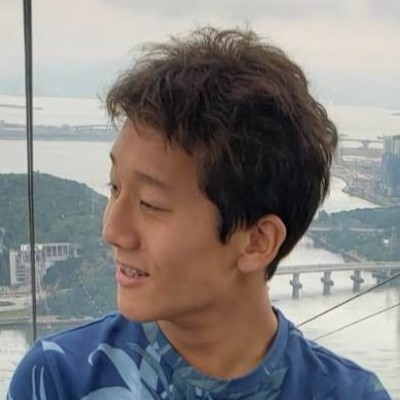
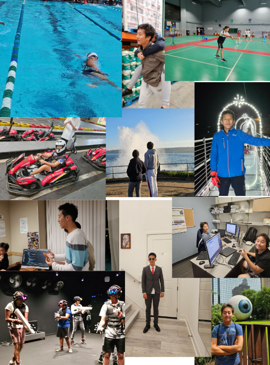

# **Hello! 👋👋👋**    
## **My name is Eric, a Junior taking CSA !**  

___

A picture of me            |  Some pictures that represent me
:-------------------------:|:-------------------------:
  |  

___

Hi my name is Eric Yu, I am interested in many areas, namely:

- Neural Networks/Machine Learning (Tensorflow, PyTorch)
- 
- Cybersecurity (Primarily Linux-based OS)
- 
- CTF Based Competitions
- 
- Swimming (Del Norte Swim Team)
- 
- Playing Video Games
- 

- ### 👨‍💻 [GitHub](https://github.com/Be1uga4life)  
  #### Feel free to check out my repositories on Github!

- ### ▶️ [YouTube](https://www.youtube.com/@ericyu1474)  
  #### Feel free to check out some of my videos (mostly for fun) on youtube!

- ### 💻 [LinkedIn](https://www.linkedin.com/in/eric-yu-391b0a21b/)  
  #### Feel free to send me an invite to connect on Linkedin